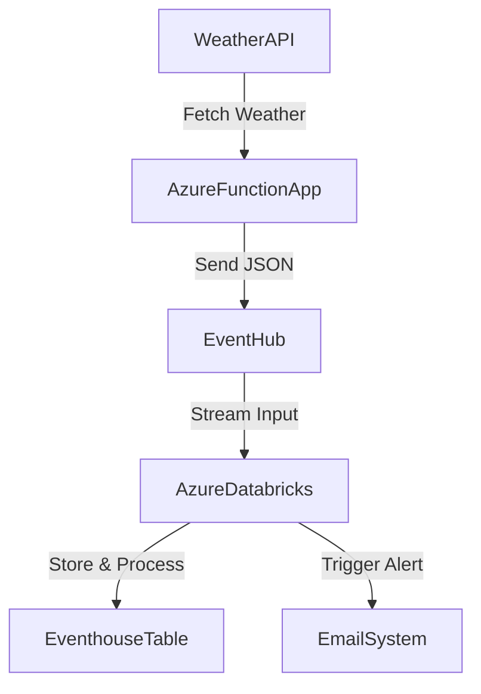

# 🌩️ live-weather-streaming-azure

Live weather streaming report using Azure Functions, Eventhub and Fabric's EventHouse. Email Alerts during high warning using Fabric's Data Activtor

---

## 🖼️ Gallery – Quick Preview

| Architecture Overview | EventStream | Email Alert | Eventhouse Table | Resource Group |
|------------------------|-------------|-------------|------------------|----------------|
|  |  |  |  |  |

---

## 🛠️ Project Overview

This project enables you to **stream live weather data** from [WeatherAPI](https://www.weatherapi.com/) to **Azure Event Hubs** using **Azure Functions**, with real-time processing on **Databricks** and **email alerts** triggered on extreme conditions.

---

## 🧰 Tech Stack

- **WeatherAPI** – Live weather data
- **Azure Event Hubs** – Streaming pipeline
- **Azure Functions** – Scheduled trigger
- **Azure Databricks** – Stream processing
- **SendGrid** – Email alert system

---

## 📡 Architecture



---

## 🚀 Setup Guide

### 1. Clone the Repository

```bash
git clone https://github.com/Tanya0139/live-weather-streaming-azure.git
cd live-weather-streaming-azure
```

### 2. Environment Variables

Create a `.env` file in your root directory:

```env
WEATHER_API_KEY=your_weather_api_key
AZURE_EVENT_HUB_CONN_STR=your_event_hub_connection_string
SENDGRID_API_KEY=your_sendgrid_api_key
```

---

## 🔁 Azure Function Setup

```bash
cd weather-streaming-function-app
func init --python
func new --name WeatherStreamFunction --template "Timer trigger"
```

Replace the default code with the function to fetch weather data and send it to Event Hub.

---

## 🧪 Databricks Stream Processing

Run this in your Databricks notebook:

```python
df = spark.readStream     .format("eventhubs")     .option("eventhubs.connectionString", "<your_connection_string>")     .load()

df.writeStream     .outputMode("append")     .format("delta")     .option("checkpointLocation", "/mnt/checkpoints")     .start("/mnt/stream-output")
```

---

## 📬 Email Alert Logic

```python
if temperature > 45 or wind_speed > 80:
    send_email(
        subject="⚠️ Extreme Weather Alert",
        content="Unusual weather conditions detected!"
    )
```

---

## 🧾 File Structure

```
├── icons_weather/
├── refrence-screenshots/
├── weather-streaming-function-app/
│   └── function code
├── .env
├── README.md
```

---

## ✨ Features

- ⏱️ 5-minute scheduled weather polling
- ⚙️ Azure-native integration
- 📊 Real-time dashboard setup ready
- 📬 Smart weather-based alert system
